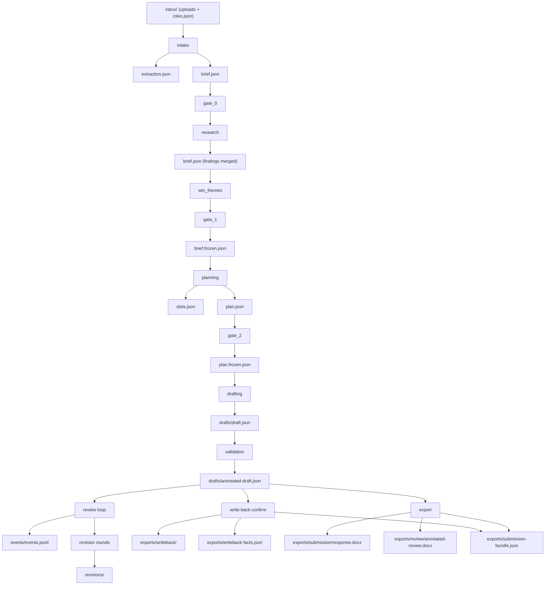

# The artifact flow

*Audience: an agent navigating this codebase as a map — the engine's real
architecture is files on disk, and this document is the order they appear in.
Every table here is machine-compared against the code by
`tests/contracts/test_graph_artifact_flow.py`, in both directions. When a test
goes red: edit the code first, run `make check`, then update the row the red
test names — never the reverse.*

## The flow

*Illustrative flow — the drift test verifies every quoted file name below exists
in engine source; the authoritative tables are further down. Each stage also
appends to `"runs/"` its run's `run.jsonl`.*

Frozen copies are written only by gate approval (`brief.frozen.json` at gate_1,
`plan.frozen.json` at gate_2); stage-skip predicates read the completed
artifacts, never a partial stage's state. The submission bundle is recomposed at
every exit door and is the record the downloads surface reads — never the
directory. Multi-source pursuits write per-file facts under merge-prefix names
(`"writeback-facts-f01.json"` pattern); flat pursuits keep the legacy names.

## Artifact kinds and their schemas

The full `engine/contracts/validate.py::_KINDS` mapping — every artifact kind
the contracts gate can validate, and the schema file that owns it. The drift
test asserts this table equals `_KINDS` AND that the `schemas/` directory holds
exactly these files.

| kind | schema |
|---|---|
| access_log | access-log.schema.json |
| annotated_draft | annotated-draft.schema.json |
| bid_brief | bid-brief.schema.json |
| canonical_doc | canonical-doc.schema.json |
| draft | draft.schema.json |
| eval_case | eval-case.schema.json |
| eval_results | eval-results.schema.json |
| feedback_event | feedback-event.schema.json |
| kb_card | kb-card.schema.json |
| kb_proposal | kb-proposal.schema.json |
| manifest | manifest.schema.json |
| metric_definition | metric-definition.schema.json |
| pursuit_plan | pursuit-plan.schema.json |
| run_log | run-log.schema.json |
| submission_bundle | submission-bundle.schema.json |
| target_slot | target-slot.schema.json |
| target_slots | slots.schema.json |
| template_fill_facts | template-fill-facts.schema.json |
| writeback_facts | writeback-facts.schema.json |

Naming note: `manifest` is the SERVICE-LINE manifest (config-side). The
per-pursuit deliverable record is `submission_bundle` — never called a manifest.

## The run log

Every run writes `runs/<run_id>/run.jsonl` (plus `config.json` beside it): one
JSON object per line, schema-validated at write time, `seq` strictly monotonic
(ordering is by `seq`, never timestamp), each record carrying at most one
exclusive payload (run/kb/gate/validation/gap/artifact/error). Every durable
output emits an `artifact` line with a content hash. The artifact-kind
vocabulary on those lines (the drift test reads it from
`schemas/run-log.schema.json`):

`annotated_draft` · `bid_brief` · `draft` · `export` · `pursuit_memory` · `pursuit_plan` · `research_pack` · `revision` · `submission_bundle` · `target_slots` · `template_fill_facts` · `write_back_file` · `writeback_facts`

## Workspace layout

Each pursuit is one directory; `engine/workspace/pursuit.py::PursuitDir` creates
these subdirectories (the drift test compares this table to `SUBDIRS`):

| subdir | holds |
|---|---|
| addenda | Amendment uploads + impact decisions (archived frozen plans on replan) |
| checkpoints | Per-stage completion markers; cleared only by gate-2 rejection or addendum replan |
| drafts | `draft.json` and `annotated-draft.json` — the live draft envelope |
| events | The review loop's landed events (`events.jsonl`) + pending comments |
| exports | The exit doors: write-back copies, facts records, rendered docx, the submission bundle |
| inbox | Operator uploads + declared roles (`roles.json`) |
| memory | Tier-2 pursuit-scoped KB store (purged with the pursuit) |
| pings | Gap pings, append-only, escalation computed at read |
| revisions | Archived draft envelopes + round records |
| runs | One directory per run: `run.jsonl` + `config.json` |
| share | Share-link records + the guest access log |

Root-level per-pursuit files (not subdirs): `extraction.json`, `brief.json`,
`brief.frozen.json`, `slots.json`, `plan.json`, `plan.frozen.json`. Workspace
siblings of the pursuits: `orgs/` (tier-3 memory), `support/` (advisor traces +
assistant sessions), `pending-calls/` (P20 handoff request/response exchanges,
retained as the audit record), `jobs.jsonl`, `serve.lock`.
