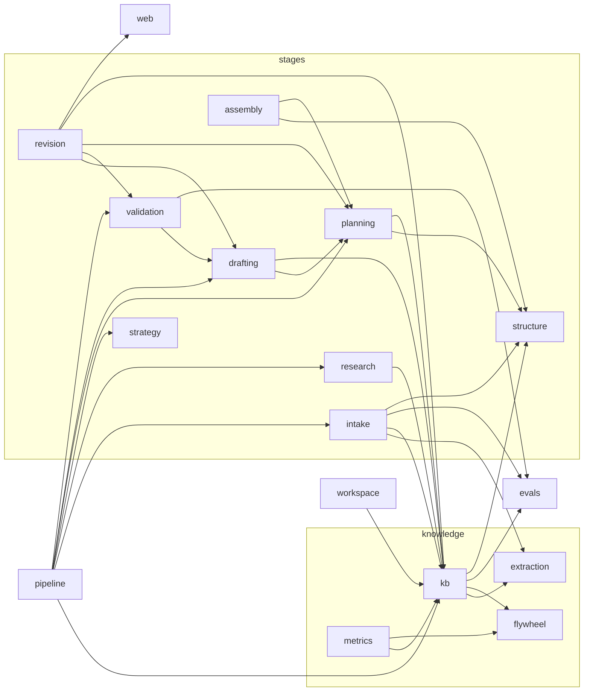

# The module graph

*Audience: an agent navigating this codebase as a map — the pilot runs this engine
through Claude Code, and this document is how it sees the structure without
excavating it. Derived from the code, never from belief: every table here is
machine-compared against an AST walk of `engine/` by
`tests/contracts/test_graph_modules.py`, in both directions. When a test in that
file goes red: edit the code first, run `make check`, then update the row the red
test names — never the reverse.*

*Mermaid rule (the drift test parses this file): edges are written `a --> b` with
bare package names — no node aliases, no edge labels. `subgraph` grouping is
allowed.*

## Package inventory

One directory per package under `engine/`. The engine root also carries
`version.py` (`engine_version()`, stamped into every run header) and
`__main__.py` (dispatches to `engine.cli.main`).

| package | purpose |
|---|---|
| assembly | Terminal outputs: submission bundle, docx render, template fill, write-back into buyer documents |
| assistant | The steward assistant: bounded tool-calling loop over read models, writes only as proposals |
| cli | `python -m engine` dispatcher — one module per command group |
| contracts | JSON-schema validation gate for every artifact and run-log line; the universal leaf dependency |
| drafting | Stage 5: per-section drafters + self-check, routed by section path |
| evals | Eval infrastructure: cases, fingerprints, suites, runner, release gates, live re-baseline |
| extraction | Document extraction (docling/VLM) behind a sandboxed subprocess seam + weight-manifest gate |
| flywheel | Improvement loop: KB proposals, attribution, routing, card survival |
| intake | Stage 1: read the inbox package, screen for injection, produce `brief.json` + gate_0 |
| kb | Three-layer knowledge-base card store: ingest, chunk, anonymize, canonicalize, retrieve, purge, lanes |
| llm | The model-call boundary: caller protocol, fake/live/handoff callers, cost ceiling, effective config |
| metrics | Metric-registry resolution + run-log walking into views |
| pipeline | The single stage-order authority (`driver.py`) + pre-flight cost forecast |
| planning | Stage 4: Path-A code mapper + Path-B outline architect, plan assembly, obligations, gate_2 |
| research | Stage 2: internal (KB) + external (pack) findings against topics |
| revision | Post-validation revision rounds against reviewer events |
| runlog | Append-only `run.jsonl` writer, digests, gapless-seq assertion |
| strategy | Stage 3: win-theme generation + judging, then gate_1 (freezes the brief) |
| structure | Target parsing: buyer workbook/docx → TargetSlots; facts → conventions → classification |
| support | In-app chat advisor: orientation only, docs-grounded, cannot mutate |
| validation | Stage 6: claim audit, compliance, consistency, buyer red-team, waivers, poison suite |
| web | The FastAPI app: every operator door (see `doors.md`) |
| workspace | Pursuit/org directory model: artifact read/write, checkpoints, run numbering |

## The import graph

**The rule (the test encodes this sentence):** an edge A→B exists iff any file
under `engine/A/` imports `engine.B` at ANY scope — function-local imports count
(the cycle-breaking lazy imports are real runtime edges). The diagram DRAWS an
edge iff A is not a door package ({cli, web, evals, assistant}) and B is not a
foundation ({contracts, runlog, llm, workspace}). The excluded edges are not
dropped: the two tables below carry them, and the drift test asserts diagram +
tables jointly cover every edge.

*(`revision --> web` is real: the revision round reads the events lane. `workspace --> kb`
is the pursuit-memory store. Both are drawn because the rule draws them.)*

### Door fan-out (edges FROM door packages, omitted from the diagram)

| door | imports |
|---|---|
| assistant | contracts, flywheel, intake, kb, llm, runlog, support |
| cli | contracts, drafting, evals, extraction, intake, kb, llm, metrics, pipeline, runlog, validation, web, workspace |
| evals | cli, contracts, intake, kb, llm, planning, runlog, structure, validation, workspace |
| web | assembly, assistant, cli, contracts, evals, flywheel, intake, kb, llm, metrics, pipeline, planning, revision, runlog, strategy, structure, support, validation, workspace |

### Foundation fan-in (edges INTO foundation packages from non-door packages, omitted from the diagram)

| foundation | imported by |
|---|---|
| contracts | assembly, drafting, extraction, flywheel, intake, kb, metrics, planning, research, revision, runlog, strategy, structure, validation, workspace |
| llm | drafting, intake, kb, pipeline, planning, research, revision, strategy |
| runlog | kb, llm, pipeline |
| workspace | intake, kb, pipeline, revision |

## The caller seam

All LLM judgment flows through one boundary, `engine/llm`:

- **`CallerFor`** (protocol, `engine/llm/caller.py`): `call_for(agent, *, tier, prompt, system="") -> CallResult`. Implementations: `FakeCaller` (the default everywhere — canned text, zero spend), `LiveCaller` (`engine/llm/live.py` — refuses construction unless `RFP_LIVE=1` and `ANTHROPIC_API_KEY` is set), and `HandoffCaller` (`engine/llm/handoff.py`, P20/B81 — writes `pending-calls/` request files and blocks, bounded, for an operator's response; zero spend, `handoff/`-prefixed models cost 0.0, opt-in per surface via `slice --handoff` / `serve --handoff`).
- **`TracedCaller`** wraps a `CallerFor` + run logger and is the only interface stages see: `call(agent, *, tier, prompt, system="", stage=..., span_id=..., ...)` — emits the `agent_call` run-log line, enforces the cost ceiling and shared `SpendBudget`.
- **Injection:** the caller is always a parameter, never a global. The pipeline driver's `StageRun` builds the per-stage `TracedCaller` from a `make_caller` factory; the web app's default factory wraps `FakeCaller` (`serve --handoff` swaps in a handoff factory for the pipeline lane only); the two interactive surfaces inject via `app.state.advisor_caller` / `app.state.assistant_caller`.

**Call sites** (the drift test AST-detects these: a `call`/`call_for` invocation
carrying `tier=` with a literal or module-constant agent name, across `engine/`
excluding `engine/llm/` itself — 19 sites: 18 `TracedCaller.call` + 1 raw
`call_for`):

| file | agent | door | sites |
|---|---|---|---|
| engine/assistant/loop.py | steward_assistant | call | 1 |
| engine/drafting/draft.py | section_drafter | call | 2 |
| engine/evals/remeasure.py | questioner | call | 1 |
| engine/intake/brief.py | intake_analyst | call | 1 |
| engine/intake/brief.py | intake_questioner | call | 1 |
| engine/kb/ingest.py | ingestion_agent | call | 1 |
| engine/planning/outline.py | outline_architect | call | 1 |
| engine/research/findings.py | external_researcher | call | 1 |
| engine/research/findings.py | internal_researcher | call | 1 |
| engine/revision/round.py | revision_agent | call | 1 |
| engine/strategy/themes.py | win_theme_strategist | call | 2 |
| engine/validation/validate.py | buyer_red_team | call | 1 |
| engine/validation/validate.py | claim_auditor | call | 1 |
| engine/validation/validate.py | claim_verifier | call | 1 |
| engine/validation/validate.py | compliance_checker | call | 1 |
| engine/validation/validate.py | consistency_checker | call | 1 |
| engine/web/server.py | advisor | call_for | 1 |

Every agent's prompt lives at `prompts/<agent>/prompt.md`, with TWO exceptions:
`steward_assistant` reads `prompts/assistant/prompt.md`, and `questioner` — the
P17 re-measure harness's one-line question-forms prompt (P2-37, P26b-3) — lives
inline in `engine/evals/remeasure.py::live_questioner`: it is a UAT-session
measurement tool over a traced LiveCaller, never a pipeline stage, and its
prompt is not fingerprint-locked to any baseline. (`prompts/shared/` holds
fragments, not an agent.) The advisor is also the one site that bypasses
`TracedCaller` — it runs zero-spend by default and traces to
`support/traces.jsonl` instead.

## Pipeline stage order

The one authority is `engine/pipeline/driver.py::advance()`; the drift test reads
the ordered `StageRun` stage literals from its source:

`intake -> gate_0 -> research -> strategy -> planning -> drafting -> validation`

gate_1 rides the strategy run and gate_2 the planning run (their approvals freeze
`brief.frozen.json` / `plan.frozen.json`). Revision rounds and assembly
(write-back, template fill, export, bundle) run post-pipeline, driven from the
web layer's doors.
